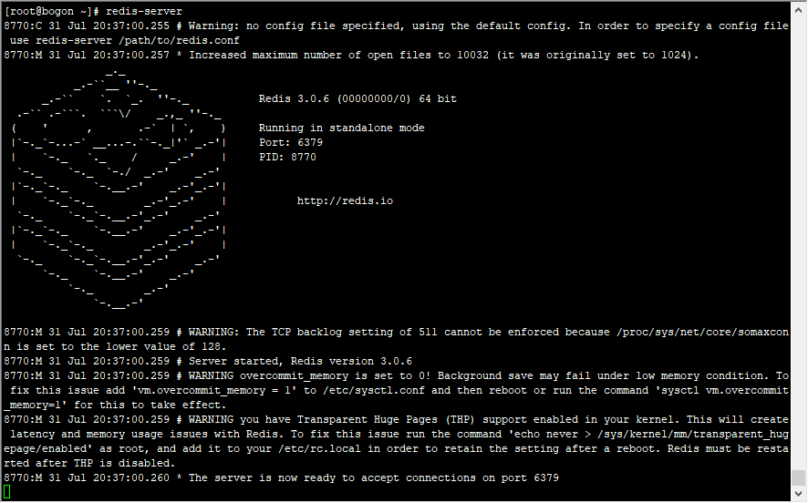

### Linux环境安装Reids

#### 1. 安装步骤
```
(1)下载redis指定版本的源码压缩包到当前目录
$ wget http://download.redis.io/releases/redis-3.0.6.tar.gz
(2)解压redis源码压缩包
$ tar zxf redis-3.0.6.tar.gz
(3)建立一个redis目录的软件连接，指向redis-3.0.6
$ ln -s redis-3.0.6 redis
(4)进入redis目录
$ cd redis
(5)编译
$ make
(6)安装
$ make install
```

安装过程出问题：

```
[root@bogon redis]# make test
cd src && make test
make[1]: Entering directory `/root/redis-3.0.6/src'
You need tcl 8.5 or newer in order to run the Redis test
make[1]: *** [test] 错误 1
make[1]: Leaving directory `/root/redis-3.0.6/src'
make: *** [test] 错误 2
```

需要安装tcl文件
```
wget http://downloads.sourceforge.net/tcl/tcl8.6.1-src.tar.gz
sudo tar xzvf tcl8.6.1-src.tar.gz  -C /usr/local/
cd  /usr/local/tcl8.6.1/unix/
sudo ./configure
sudo make
sudo make install 
```

测试是否安装成功, 查看redis版本

```
[root@bogon etc]# redis-cli -v
redis-cli 3.0.6
```

#### 2.配置、启动、操作、关闭Redis

Redis可执行文件说明

|可执行文件|作用|
|:------:|:------:| 
|redis-server| 启动Redis |
|redis-cli| Redis命令行客户端 |
|redis-benchmark| Redis基准测试工具 |
|redis-check-aof| Redis AOF 持久化文件检测和修复工具 |
|redis-check-dump| Redis RDB 持久化文件检测和修复工具 |
|redis-sentinel| 启动Redis Sentinel |


(1)、启动Redis

三种启动方式：
* 默认启动			
* 运行启动			
* 配置文件启动			

**默认启动**

```
redis-server
```

